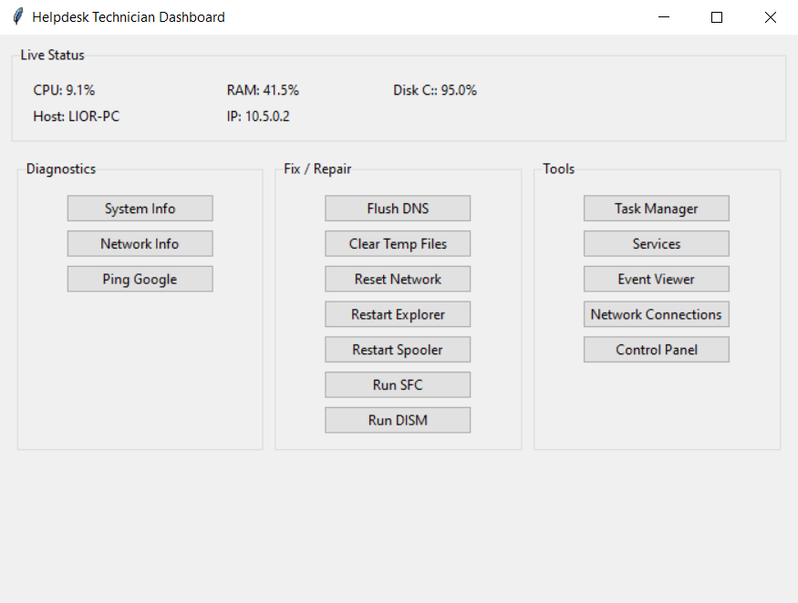

# Helpdesk Technician Dashboard v2.0.0

A modern Windows Helpdesk / IT Support Dashboard, designed to provide real-time system visibility, quick diagnostics, automated data collection, and rapid access to built-in Windows tools used for troubleshooting.

This utility is intended for helpdesk technicians and desktop support engineers who need a fast, consistent, and reliable way to gather system intelligence during troubleshooting.

## 🚀 Features
## 🔴 Live System Monitoring

Continuously displays:

CPU utilization

RAM usage

Disk usage (C:)

System temperature

Hostname

IP address

Displayed in a clean GUI for quick assessment.

## 🔍 Diagnostics

One-click diagnostic functions:

System Info
OS, Build, CPU, RAM, User, Hostname

Network Info
IP, Mask, Gateway, DNS, MAC

Ping Google (8.8.8.8)
Connectivity test

Check RAM Health

Check SMART Status

## 📦 Full Diagnostic Collection (Automated)

Creates a timestamped ZIP report on the desktop containing:

Security Log events:

4624 – Successful Logons

4625 – Failed Logons

1102 – Log Cleared

4672 – Admin Granted

## System Events:

18 – WHEA Hardware Errors

1001 – BugCheck

Windows Defender:

Computer Status

Threat Detections

systeminfo

ipconfig /all

tasklist /v

Disk drive info

RAM_Health.txt

SMART_Status.txt

Useful for collecting information during troubleshooting sessions.

## 🔧 Fix & Repair Tools

Quick recovery actions:

Flush DNS

Clear Temp Files

## 🧰 Windows Tools (Quick Launch)

Instant access to essential applications:

Task Manager

Services

Event Viewer

Network Connections

Control Panel

Remote Desktop

Windows Defender

Windows Update

Registry Editor

Troubleshooter

All launched using system handlers (no hard-coded paths).

## 🎯 Why This Tool?

This dashboard standardizes basic diagnostic procedures and saves time during:

User support calls

Performance issues

Application troubleshooting

Connectivity problems

New computer setup

Remote assistance sessions

Instead of typing commands and copying logs manually — everything is one click.

## 🛡️ Technical Overview

Language: Python 3

GUI: Tkinter

System Data: psutil, wevtutil, WMIC, PowerShell

OS Compatibility: Windows 10 / Windows 11

Packaging: PyInstaller (optional)

## 📥 Installation
Requirements
pip install psutil

## ▶️ How to Run
python helpdesk_dashboard.py

or:

py helpdesk_dashboard.py

## 📦 Build EXE (Optional)
pip install pyinstaller
pyinstaller --noconsole --onefile helpdesk_dashboard.py

The EXE will be created in:

dist/helpdesk_dashboard.exe

## 🧪 Example Diagnostic Output Structure
Desktop/
 └─ HelpdeskReport_2025-01-08_23-11-55/
    ├─ Security_Logons_4624.txt
    ├─ Security_FailedLogons_4625.txt
    ├─ Security_LogCleared_1102.txt
    ├─ Security_AdminPrivilege_4672.txt
    ├─ System_WHEA_18.txt
    ├─ System_BugCheck_1001.txt
    ├─ Defender_ComputerStatus.txt
    ├─ Defender_ThreatDetections.txt
    ├─ SystemInfo.txt
    ├─ Network_IpconfigAll.txt
    ├─ Processes_Tasklist_v.txt
    ├─ DiskDrive_Info.txt
    ├─ RAM_Health.txt
    ├─ SMART_Status.txt
    └─ HelpdeskReport_2025-01-08_23-11-55.zip

## 🖼️ Screenshot

Example UI preview:

## 🧠 Skills Demonstrated

This project shows:

Windows internal utilities usage

Event log exporting

GUI design in Python

Automation of diagnostic collection

Using PowerShell commands through Python

Standard troubleshooting methodology

Packaging Python into EXE

Clean, modular code structure

A very attractive project for Helpdesk / IT Support / Desktop Support roles.

## 🏷️ Version
Helpdesk Technician Dashboard
Version: v2.0.0
Author: Lior Simhi

## ⚠️ Disclaimer

This tool is for educational and internal support purposes only.
Running some commands may require Administrator privileges depending on Windows configuration.

## ❤️ Contributions

Feature suggestions and improvements are welcome.
Open an issue or submit a pull-request.

## ⭐ If You Like It

Support by:

## ⭐ Starring the repository

## 📄 License

© 2025 Lior Simhi. All rights reserved.
This project is for personal and educational use only.
Unauthorized copying, modification, or distribution is prohibited.

